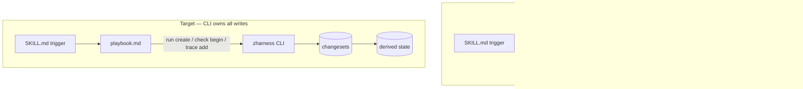

# Personal Agentic Coding Harness — Architecture Audit

**Date:** 2026-07-21
**Auditor role:** Principal AI Architect / Staff Engineer (adversarial review — not a validation pass)
**Scope:** `skills/` (14 skills), `cli/` (`zharness`, 7,813 LOC Go), `.kit/docs/playbooks/`, harness state model, rules/memory layers.
**Grounding:** every claim below traces to a file read this session, not to the project's self-description.

---

## Central Thesis (read this first)

You have built a **genuinely well-engineered state layer whose complexity is not justified by a single-user use case, and whose deterministic guarantees are partially faked by handing bookkeeping back to the LLM.**

Three facts, held together, define the whole audit:

1. **The engineering quality is high.** `changeset.go` has SQL-identifier allowlisting against untrusted input, a ULID idempotency fence, append-only replay, and `INSERT OR IGNORE` idempotency. The thin-trigger skill model is a legitimately good idea. The DDD layering is clean.
2. **The complexity is disproportionate.** 7,813 LOC of Go + ~1,578 lines of playbook prose + a 10-table SQLite schema + hand-authored JSONL changesets — to track "what phase am I on and did I verify it" for **one person**. Three entity tables (`decisions`, `backlog`, `tools`) and two scoring commands (`propose`, `score-context`) are fully built, tested, and **consumed by nothing**.
3. **The core value proposition is inverted.** A deterministic CLI exists to take error-prone bookkeeping *away* from a non-deterministic LLM. But there is no `zharness run create` or `zharness check-init` command — so the `work` playbook instructs the **LLM to hand-author two-line JSONL changesets with exact ULIDs and RFC3339 timestamps**, then warns it extensively about the `FOREIGN KEY` constraint it will hit if it gets the ordering wrong. The most error-prone bookkeeping in the system was handed back to the least deterministic component.

**The right move is not a rebuild. It is a ruthless subtraction pass plus closing the CLI gap that forces the LLM to hand-write database mutations.** Details follow.

---

## 1. Project Vision

### Assessment
The problem — "make planning/coding/reviewing/documenting structured workflows instead of isolated prompts" — is the *right* problem, and the thin-trigger-over-playbook model is a defensible answer to it. But the scope has drifted from "personal harness" to "miniature platform." The README calls it a "four-layer workflow runtime"; the code reads like a team product built for auditability and multi-agent portability that a solo user will never exercise.

### Strengths
- Correct core insight: durable, replayable state beats markdown pointers for resume/handoff.
- Tool-independence goal ("any agent that can read a file and run a CLI") is real and the playbooks honor it.
- Model routing per skill (`work: opus`, `git: sonnet`) is a genuinely mature cost lever most personal setups lack.

### Weaknesses
- The stated goals ("low token consumption," "high maintainability," "excellent DX for yourself in 6 months") are in direct tension with the delivered artifact: ~96KB of playbook prose loaded per run, a 10-table schema, and a hand-authored-changeset protocol that is the opposite of low-friction.
- "Deterministic gate verdicts" is the headline feature and it is the weakest-grounded one (see §5, §9).

### Problems
- Vision creep: features exist because upstream (`TRACE_SPEC.md`, `HARNESS_AUDIT.md`, `IMPROVEMENT_PROTOCOL.md`) had them, not because this user needs them. `score.go` and `audit.go` *say so in their own doc comments* ("reserved command not consumed by any skill this initiative").

### Recommendations
- Re-anchor the vision on one sentence: **"Never lose the thread between sessions, and never let me claim something works without proof."** Everything that doesn't serve those two outcomes is a candidate for deletion.
- Adopt a "single-user tax" rule: before adding any entity, command, or score, name the concrete moment *you alone* will read its output. If you can't, don't build it.

### Alternatives
- Keep the vision but explicitly fork "personal core" from "portable-platform ambitions" and stop shipping the latter until the former is lean.

### Trade-offs
- Cutting portability/audit features loses the "any agent" story. For a solo user that story is aspirational, not load-bearing.

### Priority: **High** — Estimated impact: **High** (governs every other cut below).

---

## 2. Overall Architecture

### Assessment
The 4-layer split (harness / workflows / skills / CLI) is conceptually clean and the dependency direction is correct (skills → playbooks → CLI → SQLite; nothing flows back up). The problem is not the *shape* of the architecture — it's the *mass* inside the harness layer and one broken boundary.

### Strengths
- Clear layering; `cli/internal/{domain,application,infrastructure,interfaces}` is textbook hexagonal and the boundaries hold.
- `harness.db` as a disposable materialized view over committed changesets is the right call — losing the DB loses nothing.
- Local-first, no network, no embeddings — cheap and private by construction.

### Weaknesses / Architecture smells
1. **The LLM is the integration layer for DB writes.** `work.md` step 2 (full mode) instructs the model to hand-write a two-line changeset file with the exact RUN ULID on line 1 and a `meta.latest_run_id` update on line 2, in order, then apply it. There is no command for this. This is the single largest smell: *non-deterministic component performing the deterministic system's most fragile operation.*
2. **Two sources of truth for playbook text.** Canonical playbooks live embedded in the Go binary (`cli/docs/embedded/playbooks/`) AND are scaffolded to `.kit/docs/playbooks/`. They are byte-identical *today* (I diffed all six), but the migration doc already records a live doc/code drift bug (#24). Two copies that must be manually kept in sync is a standing liability.
3. **Dead structural mass.** `decisions`, `backlog`, `tools` entity tables + `propose` + `score-context` commands: built, migrated, tested, wired into cobra — and referenced by **zero** playbooks (verified by grep). This is `entityColumns`/`migrations.go` weight that every reader must mentally skip.
4. **Hidden complexity leaks upward into prose.** The reason `work.md` and `check.md` are 243 and 358 lines is that the data model's sharp edges (the `runs.story_slug` NOT NULL FK, the `mode: simple` carve-outs, the `check record` skip-in-simple-mode branch) must be explained in natural language every run. **Schema complexity is being paid for in per-invocation tokens.**

### Recommendations
- **Close the boundary break:** add `zharness run create` and `zharness check begin` (or fold registration into `trace add`/`check record`) so no playbook ever hand-authors JSONL. This alone deletes ~30 lines of the most dangerous prose in `work.md`/`check.md` and removes a whole class of FK-constraint failures.
- **Single-source the playbooks:** keep only the Go embed as canonical; have `init` write them to `.kit/docs/` as a pure projection, and add a `zharness playbooks verify` (or a test) that fails CI if a hand-edited `.kit/docs/` copy diverges. Never let humans edit the scaffolded copy.
- **Delete the dead entities/commands** (see §15).

### Alternatives
- More radical: drop SQLite entirely (see §5 Alternatives). The changeset JSONL log is already the source of truth; a `zharness query` could derive state by folding the log in-memory on each call. For a single user with ≤hundreds of events, there is no performance argument for a persisted DB.

### Trade-offs
- Adding `run create`/`check begin` grows the CLI slightly — but it *shrinks* the total system, because prose is more expensive than a tested Go function.

### Priority: **High** — Estimated impact: **High**.

---

## 3. Workflow Architecture

### Assessment
The real lifecycle is `Intent → Intake(brainstorm) → Plan(to-plan) → Trace(work) → Proof(check) → Handoff/Resume(handoff/watzup)`, with `interview` and `git` as satellites. This is a *good* pipeline. Your requested stages "Review, Documentation, Knowledge Capture" map as: **Review is correctly folded into `check`** (right call — review without gate is theater). But **Documentation and Knowledge Capture are structurally under-served** — they exist only as `check`'s thin "Knowledge Sync" step and a memory system that the harness doesn't know about.

### Strengths
- Merging Review into the gate is exactly right; separate "review" skills usually rot.
- The per-phase gate (work invokes check per phase, not once at the end) correctly prevents bundling unrelated risk.
- Lane-based proof matrix (tiny/normal/high-risk × proof-class) is a strong idea — it scales rigor to blast radius instead of code volume.

### Weaknesses
- **Knowledge Capture is the stage that compounds most over 5 years and it is the weakest.** `check`'s Knowledge Sync writes to `AGENTS.md`/`CLAUDE.md` ad hoc; the `~/.claude/.../memory/` system is entirely parallel; the harness `decisions` table that *should* hold captured decisions is dead. Three disconnected knowledge sinks.
- `interview` overlaps `brainstorm` (both grill fuzzy intent). Two skills for "clarify the goal" is one too many for a solo user.
- Stage count is high. Six spine skills + interview + git = 8 mental modes. For one person, that's a lot of surface to remember which door to open.

### Recommendations
- Make Knowledge Capture a **first-class stage backed by the (currently dead) `decisions` table**, and point the `~/.claude` memory system at the same store. One knowledge sink, queryable, fed by `check` and `handoff`.
- Fold `interview` into `brainstorm` as a mode (`brainstorm --grill`), matching how `to-plan phase` is a mode not a skill.

### Alternatives
- Composability win: expose the lifecycle as a single `zharness next` that reads state and prints the one recommended command. The user stops choosing among 8 doors; the harness routes. (Partially exists in `resume`/`watzup` — promote it to the primary UX.)

### Trade-offs
- Fewer, mode-rich skills reduce discoverability-by-name but reduce cognitive load — the right trade for a solo user who already knows the pipeline.

### Priority: **Medium** — Estimated impact: **High** (knowledge capture) / **Medium** (skill consolidation).

---

## 4. Skills Architecture

### Assessment
The thin-trigger pattern (≤30-line SKILL.md that version-gates and defers to a playbook) is the best structural decision in the repo. It cleanly separates "what fires this" (Claude-facing discovery) from "how it works" (the playbook). Granularity of the *spine* is right. The satellites and the craft/shipping skills weren't re-examined here but the spine is the load-bearing part.

### Strengths
- Trigger/logic separation is excellent and rare.
- Version-gating in every spine skill prevents silent breakage on an out-of-date binary.
- `model:` + `argument-hint` frontmatter is disciplined.

### Weaknesses
- **The indirection is now 4 hops:** SKILL.md → `.kit/docs/playbooks/*.md` → CLI → DB, *plus* surviving `references/` (1,449 lines still live under `skills/workflow/`), *plus* the Go embed copy. A reader chasing "what does `check` actually do" opens up to four files.
- Versioning is per-skill (`version: "1.2.0"` in frontmatter) but there's no version relationship between a skill and the playbook it depends on. A skill can drift from its playbook silently; only the *binary* is version-gated.
- `references/git/*` is 8 files / ~600 lines for one non-harness skill — heavier than some playbooks. Worth auditing for the same over-production this report flags elsewhere.

### Recommendations
- Collapse `references/` into playbooks wherever the playbook already covers the material (the README says this was the plan — "most of it is deleted once the playbook is proven to carry the same content"; 1,449 surviving lines says the pruning stalled). Finish it.
- Add a `playbook_version` (or checksum) the skill asserts against, so skill↔playbook drift is caught, not just skill↔binary.

### Alternatives
- If you close the CLI gap (§2), several `references/` docs that exist to explain manual bookkeeping become deletable outright.

### Trade-offs
- Fewer reference files = less on-demand depth, but the depth currently duplicates playbook content, so the loss is mostly duplication.

### Priority: **Medium** — Estimated impact: **Medium**.

---

## 5. Harness Architecture

### Assessment
This is where the best code and the least-justified complexity coexist. The changeset/replay/fence machinery is correct and defensible. The SQLite database on top of it is **a materialized view you may not need**, and the scoring built on top of the schema measures the wrong things (see §9).

### Strengths
- `changeset.go` is the strongest file in the repo: allowlisted SQL identifiers against untrusted `db changeset apply <path>` input, ULID fence for idempotency, `INSERT OR IGNORE` create idempotency, append-only discipline, transactional apply+fence. This is production-grade.
- Rebuild-from-changesets is proven byte-exact (pilot evidence). Traceability is real: every mutation is a committed, ordered, replayable line.
- Determinism of *replay* is genuine.

### Weaknesses
- **SQLite may be a solution without a problem.** The DB holds nothing the changeset log doesn't already hold, is fully rebuildable, and serves a single user with 10 changesets today. `modernc.org/sqlite` pulls a large pure-Go SQLite (libc, mathutil, memory, bigfft transitive deps) into the binary to persist a view of a file you already have.
- **The hand-authored-changeset protocol** (§2) is a harness-layer failure surfacing as playbook prose: because the CLI lacks `run create`, the durable-state guarantee depends on the LLM writing correct JSONL.
- Determinism of *verdicts* (not replay) is asserted but thin (§9).

### Recommendations
- Add the missing write commands so the harness — not the LLM — owns every mutation. Non-negotiable if you keep the current model.
- **Seriously evaluate deleting SQLite.** Replace `query`/`resume`/`audit` with an in-memory fold of the changeset log computed on each invocation. You lose nothing (the DB is already derived), you delete `migrations.go` (207 LOC) + the fence bookkeeping + three heavy dependencies, and "rebuildable" becomes "there is nothing to rebuild."

### Alternatives
| Option | Keeps | Cuts | Best when |
|---|---|---|---|
| A. Status quo + add write commands | Determinism, SQLite | The LLM-writes-JSONL smell | You value the SQL query surface |
| B. Changeset log + in-memory fold (no DB) | Determinism, replay, traceability | SQLite, migrations, 3 deps | **Recommended for solo scale** |
| C. Structured markdown frontmatter + `zharness query` parser | Human-readability, zero new format | Changesets, DB, most of the CLI | If you want maximum simplicity and accept weaker audit trail |

### Trade-offs
- B loses O(1) indexed queries — irrelevant at hundreds of events. It keeps every guarantee that matters and removes the most weight.

### Priority: **High** (add write commands) / **Medium** (drop SQLite) — Estimated impact: **High** / **Medium**.

---

## 6. Context Engineering

### Assessment
Context loading is mostly disciplined at the *ambient* layer (the prior 2026-05-07 audit already cut per-message injection to ~2,481 tokens) but **expensive at the per-run layer**: a `work full` → `check full` cycle loads `work.md` (~3,000 tok) + `check.md` (~4,500 tok) ≈ **~7,500 tokens of playbook prose before any real work happens**, plus whatever `references/` get pulled.

### Strengths
- `check` Step 0 has real context discipline: "read only files relevant to the changed code," skip extraction for <30-line diffs. This is good context hygiene.
- `query state --json` as the "fast index, then verify the pointed file" pattern is the right retrieval shape.

### Weaknesses
- The playbooks pay a fixed, large token cost every invocation, and much of that cost is edge-case prose that exists to compensate for schema complexity (the FK carve-out, the simple/full branching). **Simplifying the harness directly shrinks the per-run context bill.**
- No context *expiration/compression* strategy for the artifacts themselves — `runs/` and `reports/` grow unbounded; `watzup`/`resume` will eventually load stale context with no decay rule.

### Recommendations
- Treat playbook length as a context-budget line item. Target: `check.md` under 200 lines, `work.md` under 180. Most of the cuttable mass is the simple-mode carve-outs that vanish if simple mode stops touching the DB story entirely (it nearly does already).
- Add a retention rule to `handoff`/`watzup`: only the latest N runs/reports are "hot"; older ones are archived and not loaded unless asked.

### Priority: **Medium** — Estimated impact: **Medium-High** (directly serves the stated "low token" goal).

---

## 7. Memory Design

### Assessment
There are **two parallel memory systems that do not know about each other**, and the one the harness ships (`decisions`/`backlog` tables) is dead while the one actually used (`~/.claude/.../memory/*.md` with frontmatter) lives entirely outside the harness.

### Strengths
- The `~/.claude` memory system is well-designed for what it is: typed (user/feedback/project/reference), indexed (MEMORY.md), with recency-decay awareness baked into the reminders.
- Keeping memory as flat markdown files is correct — greppable, durable, no embedding cost.

### Weaknesses
- **Semantic split-brain.** Project decisions belong in one place. Today a locked decision could land in `SPEC.md` Key Decisions, or `.kit/implementation-notes.md`, or `AGENTS.md` via Knowledge Sync, or the `~/.claude` memory, or the (dead) `decisions` table. Five candidate homes = no home.
- No retrieval strategy connecting harness state to memory: `watzup` resumes from `resume --json` but never surfaces relevant memories for the phase being resumed.

### Recommendations
- **Pick one decision store and wire the pipeline to it.** Revive the `decisions` entity as that store; have `brainstorm` (Key Decisions), `check` (Knowledge Sync), and `handoff` write to it; have `watzup` read from it. Retire the parallel path or make it a thin projection.
- Long-term/semantic memory: you do not need embeddings at this scale — a `zharness memory grep` over typed markdown is sufficient and free.

### Priority: **Medium** — Estimated impact: **High** (compounding value for a 5-year solo project).

---

## 8. Prompt Architecture

### Assessment
Prompt organization is strong at the macro level (trigger vs. playbook vs. reference is a real hierarchy) and undisciplined at the micro level (playbooks repeat framing and edge-case prose).

### Strengths
- Clear hierarchy: discovery text (SKILL.md) → operating logic (playbook) → depth (references).
- Consistent voice and structure across playbooks (Purpose / Preconditions / Steps / Anti-Patterns) — good for a maintainer.
- Anti-Patterns sections are excellent — they encode hard-won "don't do this" knowledge inline where it fires.

### Weaknesses
- Duplication: the version-gate paragraph is repeated verbatim in every SKILL.md *and* every playbook's Preconditions. The `dev` build note appears ~12 times across the corpus.
- Instruction density occasionally crosses into over-specification (the `work.md` step-2 JSONL literal is prompt *and* code — a sign logic is in the wrong layer).

### Recommendations
- DRY the version-gate: one line in the trigger, deleted from the playbook (the trigger already ran it).
- Move anything that reads like a data structure (the two-line changeset literal) out of prose and into a CLI command (§2).

### Priority: **Low-Medium** — Estimated impact: **Medium**.

---

## 9. Agent Architecture

### Assessment
Planning, execution, and human-interaction loops are well-modeled (status enums, BLOCKED taxonomy, per-task verification, "surface concerns before continuing"). **Reflection/self-correction is where the design overclaims:** the "deterministic verdict" is a proxy heuristic dressed as rigor.

### Strengths
- Execution loop is disciplined: verify-per-task, one-retry-then-BLOCK, capture output verbatim, never self-certify. This is exactly right and is the system's real quality lever.
- Failure recovery: BLOCKED_{CONTEXT,SCOPE,VERIFICATION,CONTRACT_DRIFT} taxonomy is clean and actionable.
- Human-in-the-loop discipline (never auto-commit, surface every BLOCKED) is correct for a personal tool.

### Weaknesses — the scoring is theater
- `ScoreTrace` (`score.go:67`) assigns tiers by: `summary >= 10 chars` → standard, `>= 40 chars AND >1 trace on the run` → detailed. **It scores string lengths, not evidence quality.** The doc comment admits this is a "deliberate deviation" because the schema doesn't carry the fields (`files_changed`, `errors`, `outcome`…) that would make scoring meaningful.
- `entropyScore` = `10*drift + 5*violations + 8*unlinked`, capped at 100 — a weighted count of findings, not a measure of anything actionable. A `check` consumer can't do anything with "entropy 40" that "3 drifts, 2 violations" doesn't already tell them.
- Net: the harness **collects the wrong data to score, then scores proxies of proxies, and labels the result "deterministic."** It *is* deterministic (same input → same number) but the number is near-meaningless. Determinism is not the same as validity.

### Recommendations
- **Either make the trace schema carry real evidence** (`files_changed`, `verification_cmd`, `outcome`) so scoring means something, **or delete scoring and keep the honest binary signal** the proof-matrix already gives (required cell has evidence: yes/no). The matrix is the real gate; the tier score adds ceremony, not judgment.
- Rename or retire `entropy_score` — it reads as a health metric but is a finding-count.

### Alternatives
- Replace tiers with the matrix outcome directly: `check` already fails on any missing required proof class. That's the deterministic verdict worth keeping. The tier layer is removable.

### Priority: **Medium** — Estimated impact: **Medium** (removes false confidence + code).

---

## 10. Codebase Architecture

### Assessment
Clean, conventional Go with strong tests (3,290 test LOC / 4,523 prod LOC ≈ 0.73 ratio — healthy). Folder structure and dependency direction are correct. Technical debt is concentrated in *unused surface*, not in messy code.

### Strengths
- Hexagonal layering is real and consistent; `infrastructure` has no upward deps.
- Error handling is idiomatic (wrapped errors, typed `ValidationError`/`ErrOutOfOrder`).
- Security-conscious: field-name allowlisting treats changesets as untrusted input — mature threat modeling for a personal tool.

### Weaknesses / debt
- **Dead code as first-class citizens:** `decision`/`backlog`/`tool` subcommands + `propose`/`score-context` are wired, migrated, and tested but unconsumed. Tests on dead features cost maintenance forever.
- CGO-disabled pure-Go SQLite is a heavy dependency chain for a derived cache.
- `check.md`/`work.md` prose is effectively un-testable "code" living in markdown.

### Recommendations (refactor priority order)
1. Delete dead entities/commands (`decision`, `backlog`, `tool`, `propose`, `score-context`) and their tests — biggest LOC reduction for zero behavior loss.
2. Add `run create`/`check begin` write commands (§2).
3. Evaluate SQLite removal (§5).
4. Single-source playbooks (§2).

### Priority: **Medium** — Estimated impact: **Medium-High**.

---

## 11. Token Efficiency

### Assessment
Ambient overhead is already well-managed (prior audit: ~2,481 tok/msg). The unaddressed cost is **per-run playbook loading**, which scales with harness complexity.

### Where tokens go (estimated)
| Source | Est. tokens | Frequency |
|---|---|---|
| `check.md` full load | ~4,500 | every gate |
| `work.md` full load | ~3,000 | every execution |
| `watzup.md` / `brainstorm.md` / `handoff.md` | ~2,900–3,800 each | per stage |
| Surviving `references/` (git alone ~600 lines) | ~1,000–6,000 | on demand |
| Repeated version-gate/`dev`-build boilerplate | ~50 × ~12 occurrences | corpus-wide |

**A full `brainstorm → to-plan → work → check` pass loads ~13,000–16,000 tokens of scaffolding prose before doing the actual task.** For a harness whose stated goal is "low token consumption," the scaffolding is the largest controllable consumer.

### Recommendations
- Simplify the schema → simplify the carve-out prose → shrink playbooks. The FK/simple-mode edge-case prose is the most compressible mass, and it exists *only* because of harness-model complexity. This is the through-line: **§2 and §5 cuts pay for themselves in §11.**
- DRY the boilerplate (version gate once).
- **Estimated savings: 30–40% of per-run scaffolding tokens** if playbooks hit the target lengths in §6.

### Priority: **Medium-High** — Estimated impact: **Medium-High**.

---

## 12. Cost Efficiency

### Assessment
Already good and cheap by construction — no embeddings, no retrieval API, no network. The one active lever (model routing) is used.

### Strengths
- Per-skill model routing (`work: opus`, `git: sonnet`) — right work on right model.
- Zero embedding/vector cost; grep-based retrieval is free and sufficient at this scale.

### Weaknesses
- Opus loading 4,500-token playbooks repeatedly is where real spend accrues — cost efficiency here is downstream of token efficiency (§11), not model choice.

### Recommendations
- Push more stages to Sonnet where the playbook is procedural (handoff, watzup, arguably check-gate). Reserve Opus for `brainstorm`/`work` reasoning.
- Do not add embeddings. At solo scale, grep + typed markdown beats a vector store on cost, simplicity, and debuggability.

### Priority: **Low-Medium** — Estimated impact: **Medium**.

---

## 13. Developer Experience (you, in 6 months)

### Assessment
Onboarding-yourself-later is **hurt by indirection and helped by discipline.** The playbooks are self-documenting and the anti-patterns are gold; but chasing one behavior across SKILL.md → playbook → CLI → Go embed → references is a lot of hops, and the hand-authored-changeset step is a footgun you *will* forget the rules of.

### Strengths
- Anti-Patterns + Exit Conditions sections make each skill legible without external docs.
- `watzup`/`resume` as a session-start recap is excellent DX — the harness tells you where you were.
- Migration doc and pilot evidence are unusually thorough.

### Weaknesses
- "Where is the logic?" has a 4-file answer.
- Adding a new mutating operation today means: write Go command + changeset pattern + playbook prose + keep embed and scaffold in sync. High ceremony per change.
- The hand-authored JSONL is the thing most likely to bite future-you (exact ULID ordering, FK constraints, RFC3339).

### Recommendations
- The §2/§5 cuts are *DX* fixes as much as architecture fixes: fewer hops, no hand-authored DB writes, one playbook source.
- Add a one-command "where am I / what's next" (`zharness next`) as the front door so future-you doesn't need to remember 8 skills.

### Priority: **High** — Estimated impact: **High** (this is literally the 5-year-owner test).

---

## 14. Future Evolution Roadmap

### Phase 1 — Lean the MVP (subtract)
- **Objectives:** remove dead surface, close the write-command gap, single-source playbooks.
- **Changes:** delete `decision`/`backlog`/`tool`/`propose`/`score-context`; add `run create`/`check begin`; make `.kit/docs/` a pure projection with a drift check.
- **Milestones:** no playbook hand-authors JSONL; CLI LOC down ~25–35%; playbooks under target length.
- **Risks:** low — you're removing unused code and moving fragile prose into tested Go.

### Phase 2 — Stable Personal Agent (consolidate)
- **Objectives:** unify memory, fold `interview` into `brainstorm`, decide SQLite's fate.
- **Changes:** single decision store wired brainstorm→check→handoff→watzup; evaluate/execute SQLite removal (Option B); retention rule for runs/reports.
- **Milestones:** one knowledge sink; `watzup` surfaces relevant decisions on resume.
- **Risks:** medium — memory migration needs care; SQLite removal touches query/resume/audit.

### Phase 3 — Intelligent Coding Harness (sharpen judgment)
- **Objectives:** make scoring mean something or remove it; `zharness next` as front door.
- **Changes:** enrich trace schema with real evidence fields OR delete tier scoring in favor of the matrix; router UX.
- **Milestones:** verdicts reflect evidence quality, not string length; user drives the pipeline via one command.
- **Risks:** medium — schema change touches replay; keep changesets append-only-compatible.

### Phase 4 — AI Software Engineering Platform (only if you actually want it)
- **Objectives:** the "any agent, multi-tool portability" story you designed for but don't yet use.
- **Changes:** stabilize the CLI contract as a public interface; harden for non-Claude agents.
- **Risks:** high — this is where scope creep lives. **Gate entry on real demand, not on the fact that the architecture could support it.** For a solo user, Phase 4 may be a trap; name the second user before you build for them.

---

## 15. Challenge Every Assumption

**Which components should not exist (delete now):**
- `decisions`, `backlog`, `tools` entity tables + subcommands — zero consumers (grep-verified).
- `propose`, `score-context` commands — self-documented as unconsumed.
- `entropy_score` — a finding-count masquerading as a health metric.
- The hand-authored-changeset protocol — should be a CLII command, not prose.

**Premature abstractions:**
- Full hexagonal DDD split for a solo CLI — clean, but abstraction the user count doesn't demand.
- The trace-tier scoring system — abstraction over data that can't support it.

**Workflows too complicated:**
- Simple-mode's DB carve-out prose — a symptom; simplify the model, not the explanation.

**Concepts that can merge:**
- `interview` → `brainstorm --grill`.
- The two memory systems → one.
- Intake ≈ SPEC frontmatter already — question whether `intake` needs a separate entity at all.

**Responsibilities misplaced:**
- DB writes owned by the LLM (should be the CLI).
- Canonical playbook text owned by two files (should be one).

**Elegant but low value:**
- "Deterministic verdict" scoring — deterministic ✓, meaningful ✗.
- SQLite as a rebuildable view of a log you already keep.

**If rebuilding from scratch today:**
- Keep: thin-trigger skills, playbooks, changeset log, per-task verification discipline, lane×proof matrix, model routing.
- Change: no SQLite (fold the log in memory); CLI owns 100% of writes; one decision store; 4–5 spine skills not 8; scoring = matrix pass/fail, no tiers; playbooks single-sourced from the binary.
- The result is ~40% less code, ~35% less per-run token cost, zero LLM-authored DB writes, and every guarantee that actually matters preserved.

---

# Executive Summary

This is a **high-craft system aimed slightly wrong for its user count.** The changeset/replay core is production-grade; the thin-trigger skill model is genuinely good; the execution discipline (verify-per-task, no self-certification, BLOCKED taxonomy, lane×proof matrix) is the real quality engine and should be protected. But the harness has accreted **platform-shaped complexity a single user never exercises** — three dead entity tables, two unconsumed scoring commands, a rebuildable SQLite view of a log that is already the source of truth — and, most seriously, it **hands the system's most fragile bookkeeping (durable DB writes) back to the non-deterministic LLM** because the CLI never grew the commands to own it. The stated goals (low token, high maintainability, 6-months-later DX) are all served by the *same* move: **subtract.** Do not rebuild. Cut the dead surface, close the write-command gap, single-source the playbooks, unify memory, and make the "deterministic verdict" either mean something or go away.

---

# Top 10 Highest-Impact Improvements (ranked by Impact ÷ Effort)

| # | Improvement | Why it matters | Impact | Effort | Depends on |
|---|---|---|---|---|---|
| 1 | **Add `zharness run create` / `check begin`; stop the LLM hand-authoring changesets** | Closes the one broken boundary; removes a whole class of FK failures; deletes the most dangerous prose in `work.md`/`check.md` | High | Low-Med | — |
| 2 | **Delete dead surface** (`decision`/`backlog`/`tool`/`propose`/`score-context` + tests) | ~25–35% CLI LOC gone, zero behavior lost; every future reader stops skipping it | High | Low | — |
| 3 | **Single-source playbooks** (Go embed canonical; `.kit/docs` = projection + drift check) | Kills a standing sync liability (drift bug #24 already happened) | Med-High | Low | — |
| 4 | **Unify memory into one decision store**, wire brainstorm→check→handoff→watzup | Knowledge capture is the compounding win for a 5-year solo project; today it's split 5 ways | High | Med | 2 |
| 5 | **Shrink playbooks to target length** by removing simple-mode carve-out prose | 30–40% per-run token savings; directly serves the "low token" goal | Med-High | Med | 1 |
| 6 | **Fix or remove trace scoring / entropy_score** | Removes false confidence; the lane×proof matrix is the real verdict | Med | Low-Med | — |
| 7 | **Evaluate/execute SQLite removal** (fold changeset log in memory) | Deletes `migrations.go` + 3 heavy deps + fence bookkeeping; "rebuildable" → "nothing to rebuild" | Med | Med-High | 1 |
| 8 | **Fold `interview` into `brainstorm --grill`** | One fewer door; matches the mode-not-skill pattern already used | Med | Low | — |
| 9 | **`zharness next` as the single front door** | Future-you stops remembering 8 skills; harness routes | Med | Low-Med | 4 |
| 10 | **DRY the version-gate boilerplate + retention rule for runs/reports** | Small steady token + context savings; bounds unbounded growth | Low-Med | Low | — |

**Do first (this week):** #1, #2, #3 — all low-effort, high-leverage, no dependencies.

---

# Overall Scores (0–100)

| Dimension | Score | One-line rationale |
|---|---:|---|
| Vision | 72 | Right problem; scope crept past "personal." |
| Architecture | 70 | Clean layering, one broken boundary, too much mass. |
| Workflow Design | 80 | Strong pipeline; knowledge-capture under-served. |
| Skills Design | 82 | Thin-trigger model is the best decision here. |
| Harness Design | 68 | Great changeset core; SQLite + hand-authored writes drag it. |
| Prompt Architecture | 74 | Good hierarchy; duplicated boilerplate; logic-in-prose. |
| Context Engineering | 66 | Ambient managed; per-run playbook load is heavy. |
| Memory Design | 55 | Split-brain across 5 sinks; the harness store is dead. |
| Agent Design | 76 | Execution discipline excellent; reflection/scoring is theater. |
| Code Quality | 82 | Idiomatic, well-tested, security-aware; dead surface is the debt. |
| Developer Experience | 65 | Great recaps and anti-patterns; 4-hop indirection + JSONL footgun. |
| Token Efficiency | 63 | Ambient good; scaffolding is the largest controllable cost. |
| Maintainability | 68 | High per-change ceremony; two sources of truth for playbooks. |
| Extensibility | 72 | Adding an op is clean in Go but ceremonious end-to-end. |

**Weighted overall: ~71/100** — a strong, well-built system carrying ~30 points of self-inflicted complexity that subtraction, not redesign, recovers.

---

# Final Verdict

**Evolve it — aggressively subtract, do not rebuild.**

If I owned this for five years alone, I would keep it, because the two hardest things to build well are already built well: the append-only changeset core with untrusted-input hardening, and the execution discipline (verify-per-task, no self-certification, lane×proof gating). Those are the load-bearing walls and they are sound. A rebuild would risk them to fix problems that are *removable*, not *structural*.

The problems are additive, not foundational: dead entities, a rebuildable database, scoring that measures string length, memory split five ways, and one inverted responsibility where the LLM hand-writes the database mutations the CLI should own. Every one of those is a *subtraction* or a *small addition* (two write commands), not a redesign. The system scores ~71 today; the same architecture, minus its accreted platform-shaped mass and with the write-boundary closed, is a low-80s personal harness that is cheaper per run, has one place to look for each thing, and never lets the non-deterministic component touch durable state.

The trap to avoid is Phase 4. This architecture *can* become a multi-agent platform, and that capability is seductive. For a single user, building toward the second user before the second user exists is exactly the over-production this harness is otherwise disciplined enough to warn against in its own Anti-Patterns sections. Name the second user first. Until then: subtract, sharpen, and let the good core carry the next five years.
