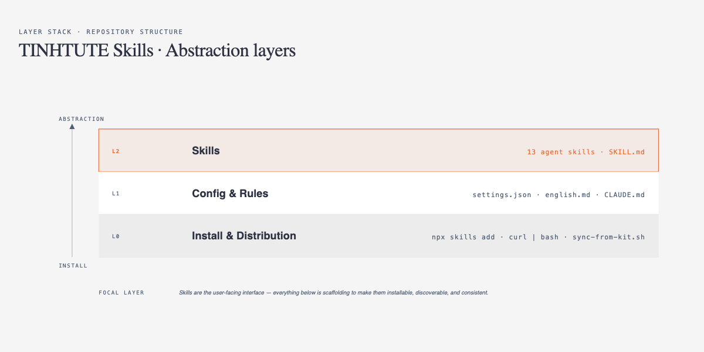
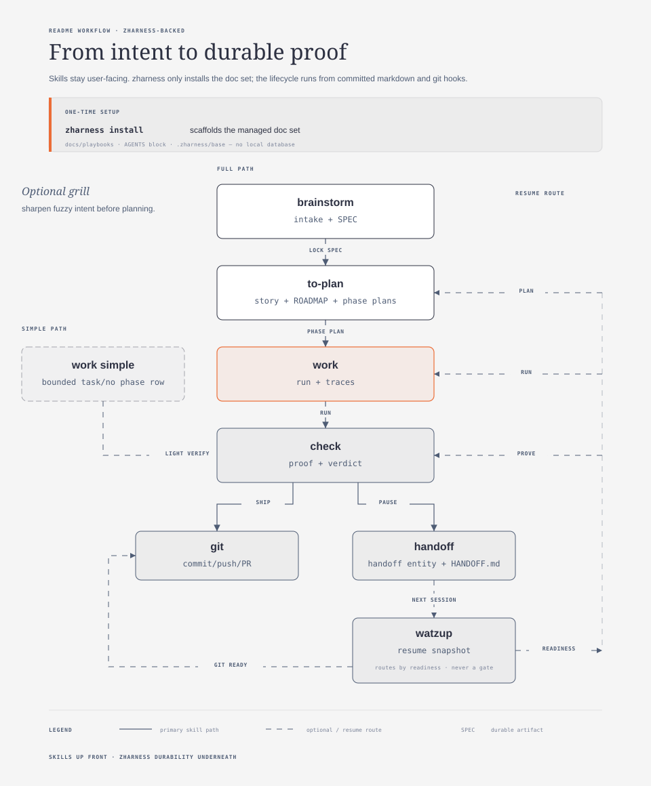

# TINHTUTE Skills

A collection of personal Claude Code skills following the [skills.sh](https://skills.sh) ecosystem format.

## Structure




## Machine Setup

Full bootstrap for a new machine — installs CLAUDE.md, rules, hooks, statusline, and all skills:

```bash
git clone git@github.com:therealtinhtute/skills.git ~/skills
bash ~/skills/setup/install.sh
```

After install: edit `~/.claude/settings.json` and set `ANTHROPIC_AUTH_TOKEN`.

**Skills only** (no config changes):

```bash
npx skills add git@github.com:therealtinhtute/skills.git -a claude-code -g -y
```

### What `install.sh` installs

| Component | Source | Target |
| :--- | :--- | :--- |
| Global CLAUDE.md | `setup/CLAUDE.md` | `~/.claude/CLAUDE.md` |
| Rules | `rules/*.md` | `~/.claude/rules/` |
| Hooks | `setup/hooks/` | `~/.claude/hooks/` |
| Settings template | `setup/settings.json` | `~/.claude/settings.json` (new machines only) |
| Statusline | `scripts/setup-statusline.sh` | `~/.claude/statusline.sh` |
| All skills | GitHub | `~/.claude/skills/` via npx |

### Individual installs

Install just a rule:
```bash
cp rules/karpathy-guidelines.md ~/.claude/rules/
cp rules/english.md ~/.claude/rules/
cp rules/ask-user-question.md ~/.claude/rules/
```

Install just the settings template:
```bash
cp setup/settings.json ~/.claude/settings.json
# Edit: set ANTHROPIC_AUTH_TOKEN
```

Install just the statusline:
```bash
bash scripts/setup-statusline.sh
```

## Skills

| Skill | When | What it does |
| :--- | :--- | :--- |
| [`/bash-tui`](skills/bash-tui/SKILL.md) | Building interactive terminal UIs | Build bash/shell TUI apps with menus, selectors, forms, progress bars, spinners, banners, and color output. |
| [`/brainstorm`](skills/brainstorm/SKILL.md) | Ideation, architecture decisions, multi-option choices | Explore options, evaluate trade-offs, and recommend the simplest viable path. |
| [`/git`](skills/git/SKILL.md) | Staging, committing, pushing, PRs, merges | Git operations with conventional commits. Auto-splits commits by type/scope. Security scans for secrets. |
| [`/handoff`](skills/handoff/SKILL.md) | Session end, context switches, milestones | Capture session state and write HANDOFF.md for seamless continuation. |
| [`/interview`](skills/interview/SKILL.md) | Validating plans before implementation | Interview about plans using AskUserQuestion. Explore technical decisions, UI/UX, concerns, tradeoffs. Write validated spec. |
| [`/librarian`](skills/librarian/SKILL.md) | Researching external GitHub repos | GitHub code research via gh CLI. Find symbols, grep code, gather evidence without cloning. |
| [`/plan`](skills/plan/SKILL.md) | After spec, before implementation | Turn a locked `.planning/SPEC.md` into a roadmap, per-phase context, and executable wave-based plans. |
| [`/prompt-leverage`](skills/prompt-leverage/SKILL.md) | Improving prompts, building frameworks | Strengthen raw user prompts into execution-ready instruction sets for AI agents. |
| [`/check`](skills/check/SKILL.md) | Before commit, PR, or merge; after implementing a plan | Gate (tests, lint, build) + code review (security, architecture, quality). Also executes approved plans from `/think`. |
| [`/skill-creator`](skills/skill-creator/SKILL.md) | Creating or updating Claude skills | Create or update Claude skills optimized for Skillmark benchmarks. |
| [`/spec`](skills/spec/SKILL.md) | Before roadmap or implementation planning | Turn an idea or files into a locked `.planning/SPEC.md` with scope, constraints, and acceptance criteria. |
| [`/turbo-mono-platform`](skills/turbo-mono-platform/SKILL.md) | Working on the monorepo stack | Full-stack TypeScript monorepo guidance (Turborepo, Next.js, Hono, tRPC, Drizzle, etc.). |
| [`/watzup`](skills/watzup/SKILL.md) | End of work session, before PR | Review recent changes and wrap up current work session. Analyze commits, assess quality, identify risks. |

## Response convention

This repo follows a shared output convention inspired by Waza for active skills:

- the first response line should start inline with `🥷`
- the opening line should contain the verdict, recommendation, state, or next move
- outputs should be sharp, compressed, and decision-useful
- generic "default assistant" filler is considered a quality failure

The icon is the visible mode switch. The real standard is the writing: concrete, direct, and specific to the skill.

## Recommended workflow: `spec` + `plan` + friends

Use the two planning skills as the front door, then hand off to the existing execution / check / wrap-up skills.



Canonical pipeline:
```
brainstorm → spec → plan → interview → implement → review/check → handoff/watzup
```

### 1. Lock the problem with `spec`
Use `spec` when you have a raw idea, notes, or a feature request and want a clean `.planning/SPEC.md` before implementation.

### 2. Derive execution with `plan`
Use `plan` only after the spec is locked. It turns `.planning/SPEC.md` into `.planning/ROADMAP.md` plus per-phase `-CONTEXT.md` and `-PLAN.md` files.

### 3. Pull in support skills only when needed
- use [`/check`](skills/check/SKILL.md) after implementation for gate checks and code analysis
- use [`/git`](skills/git/SKILL.md), [`/watzup`](skills/watzup/SKILL.md), and [`/handoff`](skills/handoff/SKILL.md) to close or transfer a work session cleanly

### Mental model
- `spec` = lock **WHAT**
- `plan` = lock **HOW**
- `check` = catch risk and prove readiness (gate + analysis)
- `git` / `watzup` / `handoff` = wrap up with discipline

## Local Development

This repo is the stable release. The incubator workspace is a local clone at a path of your choice.

To iterate quickly on a skill before publishing, point Claude Code at your local skill directory:

```bash
claude-code add-dir /path/to/your/local/skill
```

To sync changes from an incubator to this repo:

```bash
bash scripts/sync-from-kit.sh
```

## License

MIT
